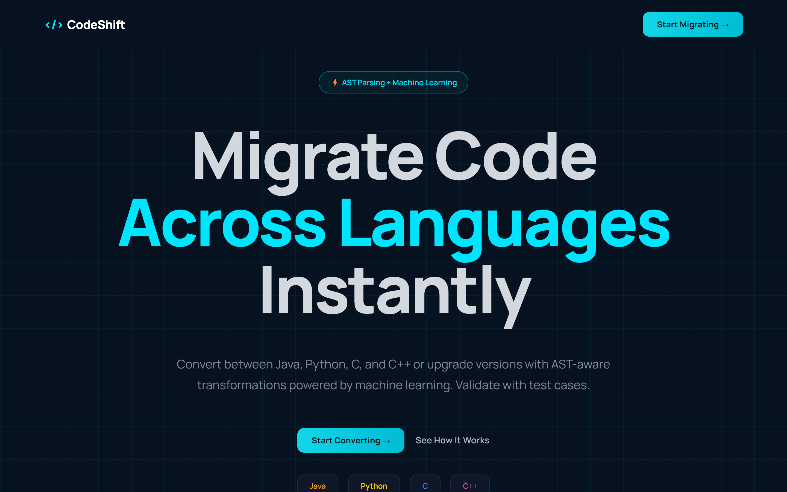
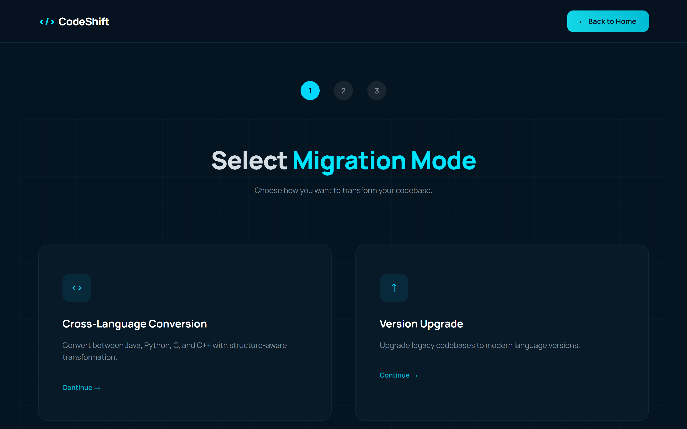
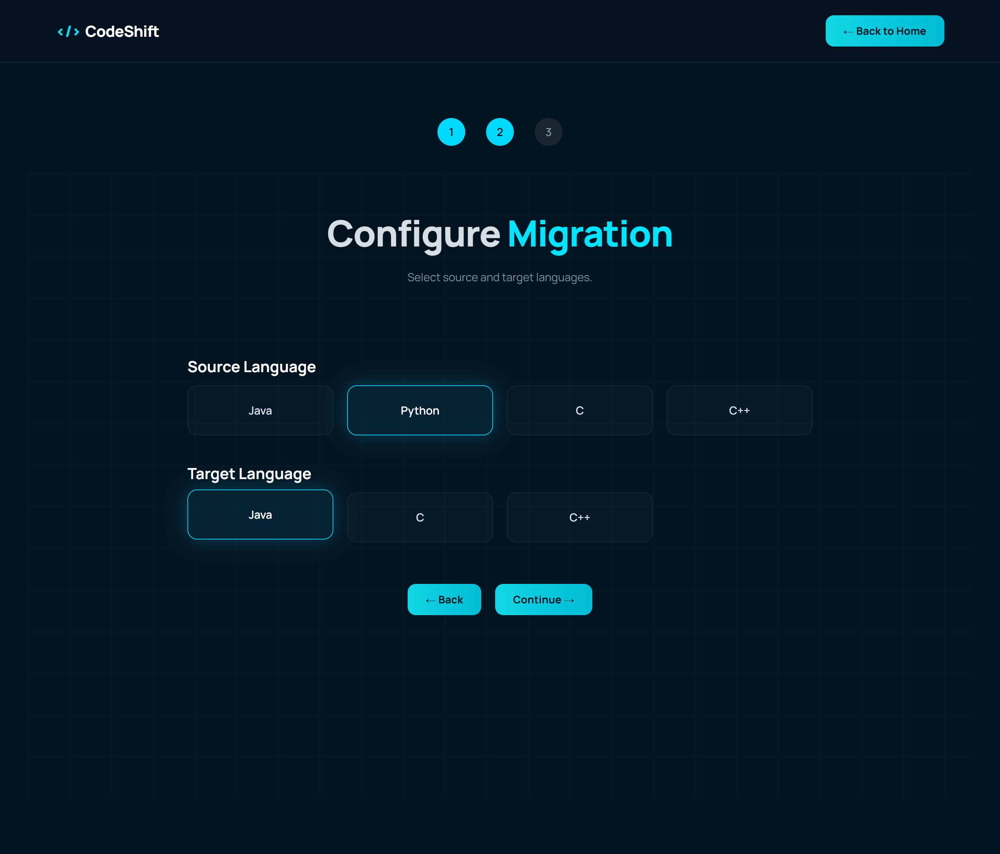
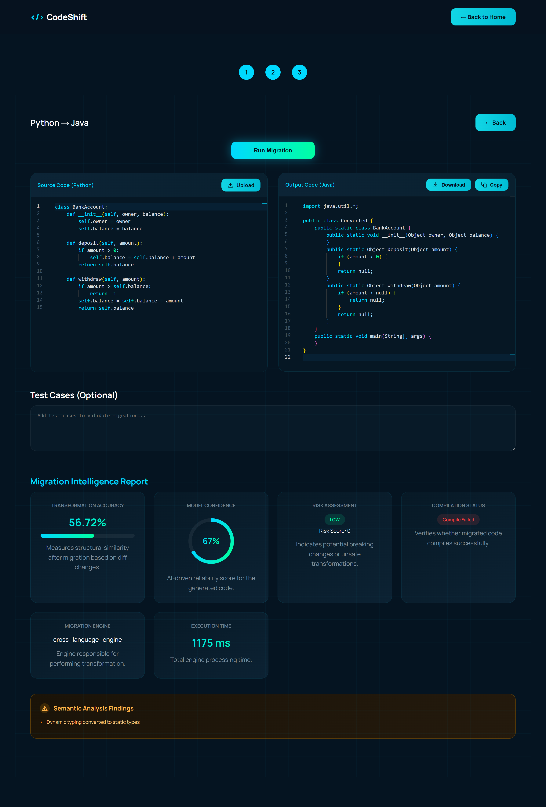
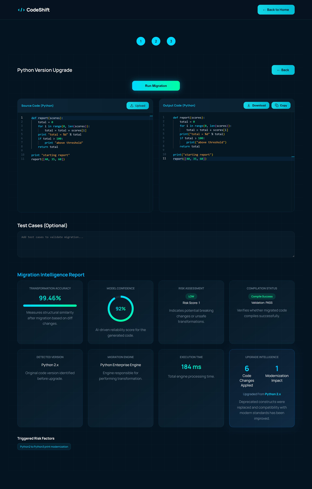
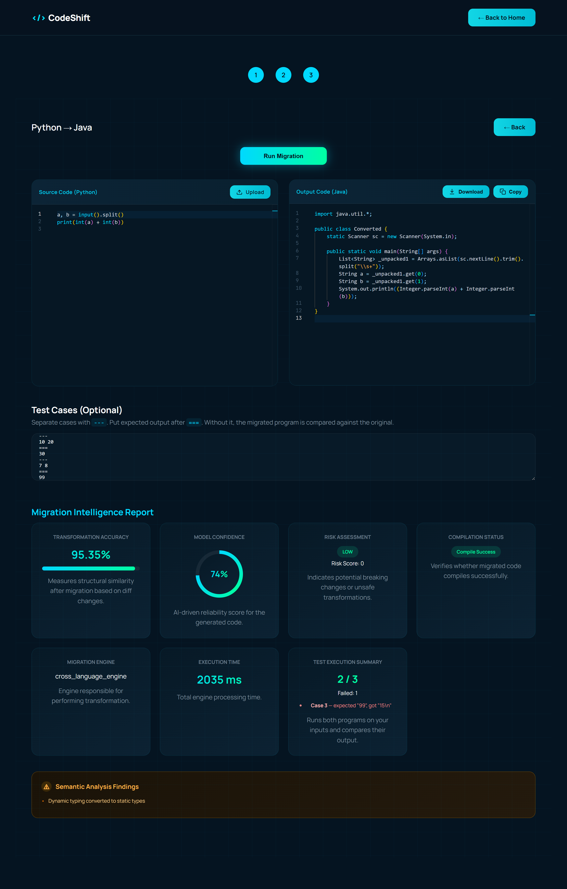
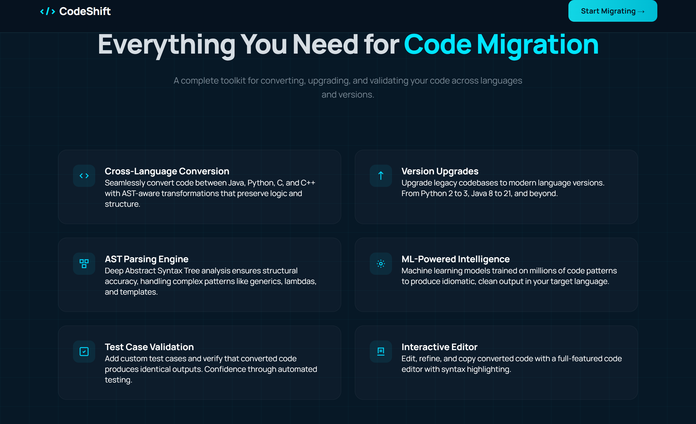
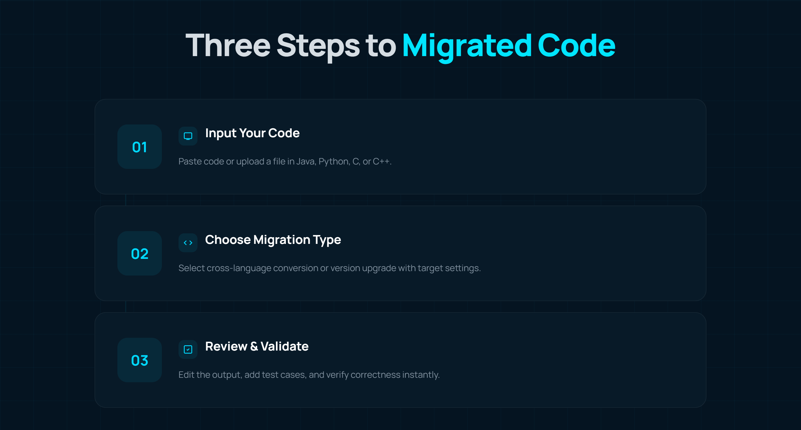

<div align="center">

# CodeShift

**Automated Code Migration System**

Convert source code between Java, Python, C and C++ — or upgrade a legacy codebase to a
modern language version — through AST-aware transformation, then score the result with
trained ML models instead of trusting it blindly.

[](https://github.com/thanmai-kolli/automated-code-migration-system/actions/workflows/ci.yml)

</div>



---

## What it does

CodeShift is built around two independent migration engines behind one Flask API and one
React workspace.

| Engine | What it does | Supported |
| --- | --- | --- |
| **Cross-Language** | Parses source into a language-neutral IR, infers types across the whole program, regenerates it in the target language | All 12 ordered pairs of Python, Java, C, C++ |
| **Version Upgrade** | Detects the language version in use and rewrites deprecated constructs | Python → 3.12, Java → 17, C → C17, C++ → C++20 |

Every run returns a **Migration Intelligence Report** — not just converted code:

- **Transformation accuracy** (0–100) from a `RandomForestRegressor`
- **Model confidence** (0–1) from a separate trained regressor
- **Risk level + triggers** — which specific constructs are unsafe to migrate
- **Compilation status** — the output is actually handed to `javac` / `gcc` / `g++` / `ast.parse`
- **Semantic findings** — e.g. dynamic typing collapsed into static types
- Token / AST / structure similarity, unified diff, and engine timing

> **The translation itself is fully deterministic.** Source is parsed to an AST,
> lowered to an IR, type-annotated and re-emitted. No LLM or generative model is
> involved, so the same input always produces the same output. Machine learning is
> used only to *score* a finished conversion (accuracy and confidence) and to
> auto-detect the source language when the caller omits it.

---

## Architecture

```
codeshift-frontend/          React 19 + Vite + Monaco  →  3-step migration workspace
        │  POST /api/*  (proxied by Vite in dev)
        ▼
codeshift-backend/           Flask API
        ├── api/                     route blueprints
        ├── cross_language_system/   parse → IR → semantics → generate → validate → score
        └── version_upgrade_system/  detect version → transform → validate → risk → score
```

Both engines also run standalone as interactive terminal tools, from `codeshift-backend/`:
`python -m cross_language_system.main_cross` and `python -m version_upgrade_system.main`.

### Cross-language pipeline

```
source ─► parser ─► IR nodes ─► type annotator ─► semantic analyzer
                                    │
       score ◄── confidence/accuracy models ◄── validator ◄── generator
```

The **type annotator** is what makes statically typed targets usable. Python and
C carry almost no type information at the syntax level, so a three-pass whole-
program analysis resolves every parameter, field, local and return type before
generation:

- **literals and annotations** seed the initial types
- **usage** narrows them — `amount > self.balance` makes `amount` numeric, `total += s`
  makes `s` whatever `total` is, `for x in xs` makes `xs` a list of `x`'s type
- **call sites** feed actual argument types back into definitions
- **constructor assignments** unify a parameter with the field it initialises

Without it every generated signature degrades to `Object`, which does not compile.

Parsers: Python via `ast`, Java via `javalang`, C/C++ via a recursive-descent
parser over the procedural subset. C ↔ C++ additionally uses a direct text
rewriter, which round-trips those two exactly.

### Accuracy by direction

Measured on the sample programs in `tests/test_conversion_fidelity.py`; every
direction compiles with the real toolchain (`javac` / `gcc` / `g++` / `ast.parse`).

| | → Python | → Java | → C | → C++ |
| --- | --- | --- | --- | --- |
| **Python →** | — | 96.3 | 79.0 | 89.3 |
| **Java →** | 99.9 | — | 89.6 | 89.7 |
| **C →** | 96.9 | 92.3 | — | 100 |
| **C++ →** | 96.3 | 92.0 | 100 | — |

---

## Quick start

**Prerequisites** — Python 3.10+, Node 18+. Optional but recommended for compile
validation: `javac` on PATH (Java output), `gcc` / `g++` (C/C++ output).

**Backend**

```bash
cd codeshift-backend
python -m venv .venv && .venv\Scripts\activate    # PowerShell
pip install -r requirements.txt
python flask_app.py                                # http://127.0.0.1:5000
```

**Frontend** (in a second terminal)

```bash
cd codeshift-frontend
npm install
npm run dev                                        # http://localhost:5173
```

That's it — Vite proxies `/api` to Flask, so no CORS setup is needed in development.

<details>
<summary>Configuration</summary>

| Variable | Where | Default | Purpose |
| --- | --- | --- | --- |
| `HOST` / `PORT` | backend | `127.0.0.1` / `5000` | bind address |
| `FLASK_DEBUG` | backend | `0` | set `1` for auto-reload |
| `CORS_ORIGINS` | backend | `http://localhost:5173,http://127.0.0.1:5173` | allowed origins when *not* using the Vite proxy |
| `CODESHIFT_ENABLE_TEST_EXECUTION` | backend | `0` | set `1` to run test cases — **executes submitted code locally** |
| `CODESHIFT_TEST_TIMEOUT` | backend | `5` | per-run timeout in seconds |
| `VITE_API_PROXY_TARGET` | frontend | `http://127.0.0.1:5000` | where the dev proxy points |
| `VITE_API_BASE_URL` | frontend | `/api` | absolute API origin for production builds |

Copy `codeshift-frontend/.env.example` to `.env` to override.

</details>

---

## API

### `POST /api/cross-language`

```jsonc
// request
{ "code": "def add(a, b): ...", "source_language": "python", "target_language": "java" }

// response
{ "success": true, "data": {
    "code": "...", "source": "python", "target": "java",
    "accuracy": 56.72, "confidence": 0.67,
    "compile_success": false, "compile_errors": [ ... ],
    "semantic_issues": ["Dynamic typing converted to static types"],
    "risk_score": 0, "diff_count": 12, "diff_text": "...",
    "token_similarity": 0.71, "ast_similarity": 0.917, "structure_similarity": 0.88,
    "timeTakenMs": 1065
}}
```

### `POST /api/version-upgrade`

```jsonc
// request
{ "code": "print 'hi'", "language": "python" }

// response — adds detected_version, risk_level, risk_triggers, validation_status
{ "success": true, "data": {
    "code": "print('hi')", "engine": "Python Enterprise Engine",
    "detected_version": "Python 2.x", "validation_status": "PASS",
    "risk_level": "LOW", "risk_triggers": ["Python2 to Python3 print modernization"],
    "accuracy": 99.43, "confidence": 0.922, "compile_success": true
}}
```

`GET /` is a health check. Failures return `{ "success": false, "error": "..." }` with a
`4xx`/`5xx` status. Request bodies are capped at 1 MB.

---

## Behavioural test validation

Compiling proves the output is *valid*. Running it proves the output is *correct*.
Both endpoints accept an optional `test_cases` string; the engine then compiles and
runs **both** the original and the migrated program against the same stdin and compares
their stdout.

```
2 3
===
5
---
10 20
===
30
```

Cases are separated by `---`, input and expected output by `===`. The `===` half is
optional — without it the migration is compared against the original program, so a
behavioural regression is caught with no expected output written at all.

```jsonc
"test_results": {
  "enabled": true, "total": 2, "passed": 2, "failed": 0,
  "cases": [{ "index": 1, "input": "2 3", "expected": "5",
              "source_output": "5\n", "target_output": "5\n",
              "compared_against": "expected output", "passed": true }]
}
```

> **This executes submitted source code**, so it is off unless you set
> `CODESHIFT_ENABLE_TEST_EXECUTION=1`. Runs are capped at 5 s and 20 cases, use a
> throwaway working directory and a minimal environment, but they are **not** a
> sandbox — enable this only for local use, never on a shared or public host.

---

## Tests

```bash
cd codeshift-backend
pip install pytest
python -m pytest -q          # 120 tests
```

Covers the Python version detector, the AST validator, every Python 2 → 3 rule,
indentation-preserving upgrades, diff/change counting, the language registry,
similarity scoring, every API route including the 1 MB payload limit, the test executor
(parsing, the opt-in gate, timeouts, cleanup, cross-language runs), plus conversion
fidelity: parser coverage, type inference, generated-code content, and a compile check
on all 12 language pairs.

```bash
cd codeshift-frontend
npm run lint
npm run build
```

Both suites run on every push and pull request — see [ci.yml](.github/workflows/ci.yml).

---

## Screenshots

<table>
<tr>
<td width="50%"><br><sub><b>1.</b> Pick cross-language or version upgrade</sub></td>
<td width="50%"><br><sub><b>2.</b> Pick a source, then any of the other three as target</sub></td>
</tr>
</table>

**3. Migrate and read the report** — side-by-side Monaco editors, then the full intelligence report.



**Version upgrade** — Python 2 detected, `print` statements modernised, output validated.



**Behavioural test validation** — both programs run on your inputs; the third case here
deliberately expects the wrong answer, and is caught.



<details>
<summary>More of the landing page</summary>




</details>

---

## ML models

Four scikit-learn models ship with the repo as `.pkl` files:

| Model | Task | Trained on |
| --- | --- | --- |
| `confidence_model.pkl` | reliability of a conversion (0–1) | `ml/confidence_training_data.csv` (500 rows) |
| `accuracy_model.pkl` | transformation accuracy (0–100) | `ml/accuracy_training_data.csv` (500 rows) |
| `language_model.pkl` | source-language auto-detection | generated corpus |
| `version_confidence_model.pkl` | upgrade confidence | `core/version_training_data.csv` |

Features are shared across the first two: `diff_count`, `semantic_issues`,
`compile_success`, `risk_score`, `token_similarity`, `ast_similarity`,
`structure_similarity`.

Retrain any of them from source:

```bash
cd codeshift-backend/cross_language_system/ml
python train_confidence_model.py
python train_accuracy_model.py
```

> The pinned `scikit-learn` version in `requirements.txt` matches the version the models
> were fitted with. Installing a different minor release will emit
> `InconsistentVersionWarning` — retrain rather than ignore it.

---

## Repository layout

```
codeshift-backend/
  flask_app.py                      app factory + health route
  api/                              cross-language & version-upgrade blueprints
  tests/                            pytest suite (engines + API routes)
  cross_language_system/
    core/                           dispatcher, IR, type annotator, symbol table,
                                    semantic analyzer, similarity + scoring engines
    parsers/ generators/ validators/    one module per language
    ml/                             models, training data, training scripts
  version_upgrade_system/
    config.py                       target version per language
    core/                           upgrade engine, risk scorer, confidence model
    languages/{python,java,c,cpp}/enterprise_engine/
                                    per-language transformer, validator, risk analyzer

codeshift-frontend/src/
  pages/          Landing, Migration
  components/     landing/, migration/{steps,workspace,report}, layout/
  services/       migrationService.js — the only place that talks to the API
  utils/          language.js — label → Monaco id / file extension
```

---

## Known limitations

- The C/C++ parser covers the common procedural subset — functions, structs, simple
  classes, control flow and expressions. Templates, macros, multiple inheritance and
  pointer arithmetic are not modelled.
- Where a Python type genuinely cannot be inferred, the target falls back to `Object`
  (Java), a `template` parameter (C++) or `int` (C, which has no generics). The
  semantic-issues list reports each such decision.
- Python → C is the weakest direction: C has no strings, no growable lists and no
  exceptions, so arrays are emitted with a companion `_length` variable and `try`
  blocks are inlined with a comment.
- The version-upgrade engine covers a curated rule set per language, not the full
  2to3 / JDK migration surface. Python currently rewrites `print` statements,
  `iteritems`/`iterkeys`/`itervalues`, `xrange`, `raw_input`, `unicode`, `basestring`,
  `long`, `<>`, `has_key` and comma-style `except` clauses; every applied rule is
  listed in the report's risk triggers, and a rewrite that fails to parse is discarded
  in favour of the original.
- `test_success` currently mirrors syntax validation unless test cases are supplied and
  `CODESHIFT_ENABLE_TEST_EXECUTION=1`, in which case it reflects real execution.
